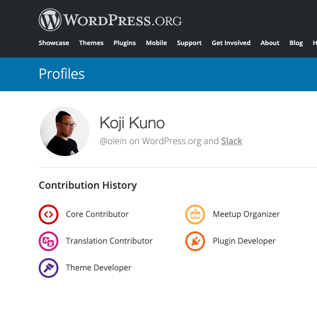

autoscale: true
slide-transition: fade(.5)

# **TwentyNineteen**から読み解く<br>テーマ作成時のお作法

#### 2019年9月7日（土）<br>みんなの森 ぎふメディアコスモス おどるスタジオ

### **OleinDesign 久野 晃司**

---

# 自己紹介

- フリーランスWeb制作者＠岐阜市
- Gifu WordPress Meetup 共同オーガナイザー
- CoderDojo岐阜 チャンピオン
- グラフィックデザイン出身、Web関連会社での勤務歴なし
- Webは100%独学 WordPress歴10年以上
- **olein-design.con @Olein_jp**
- **嫁様が埼玉に単身赴任中につき家事育児多めの生活**

---

# 自己紹介 [^1]



[^1]: [https://profiles.wordpress.org/olein/](https://profiles.wordpress.org/olein/)

---

## WordPressの公式テーマを読み解いて<br>**実際のテーマ制作（主に受託制作）に役立てられる作法**を紹介します。

---

# 確認環境

- ローカル開発環境（Local by flywheel）[^2]
- WordPress 5.2.2
- PHP 7.2.9
- MySQL 5.7.23

[^2]: [https://localbyflywheel.com/](https://localbyflywheel.com/)

---

# 利用プラグイン

- Show Current Template [^3]

[^3]: [https://ja.wordpress.org/plugins/show-current-template/](https://ja.wordpress.org/plugins/show-current-template/)

---

# テーマユニットテスト [^4]

- 投稿や固定ページのダミーデータが提供されている
- 様々な状況を想定したデータ
- 表示を確認して対応ができる

[^4]: [https://wpdocs.osdn.jp/テーマユニットテスト](https://wpdocs.osdn.jp/テーマユニットテスト)

---

# 必要な事前知識

- HTML
- CSS
- JavaScript
- PHP

and more you need.

---

>わからないことは恥ずかしいことではない。
>ただ、調べず（学ぼうとせず）わからないと言っているのは恥ずかしいことだ。
-- Koji Kuno

---

# わからないことは調べよう

- HTML→[https://developer.mozilla.org/ja/docs/Web/HTML](https://developer.mozilla.org/ja/docs/Web/HTML)
- CSS→[https://developer.mozilla.org/ja/docs/Web/CSS](https://developer.mozilla.org/ja/docs/Web/CSS)
- JavaScript→[https://developer.mozilla.org/ja/docs/Web/JavaScript](https://developer.mozilla.org/ja/docs/Web/JavaScript)
- PHP→[https://www.php.net/manual/ja/](https://www.php.net/manual/ja/)
- WordPressに関すること→[https://wpdocs.osdn.jp](https://wpdocs.osdn.jp)

---

# テーマ内ファイル一覧（前半）

```
├ classes/
├ fonts/
├ inc/
├ js/
├ sass/
├ template-parts/
├ 404.php
├ archive.php
├ comments.php
├ footer.php
├ functions.php ##これこれ
├ header.php
├ image.php
├ index.php
```

---

# テーマ内ファイル一覧（後半）

```
├ package.json
├ package-lock.json
├ page.php
├ postcss.config.js
├ print.scss
├ print.css
├ readme.txt
├ screenshot.png
├ search.php
├ single.php
├ style.scss
├ style.css
├ style-editor.scss
├ style-editor.css
├ style-editor-customizer.scss
├ style-editor-customizer.css
├ style-rtl.css
```

---

# functions.php [^code]

[^code]: [https://github.com/WordPress/twentynineteen/blob/master/functions.php](https://github.com/WordPress/twentynineteen/blob/master/functions.php)

---

# functions.phpでやっていること

後方互換設定/翻訳ファイル設定/**自動フィードリンク設定**/**タイトルタグ設定**/**サムネイル設定**/**カスタムメニュー設定**/**HTML5使用許可設定**/カスタムロゴ設定/カスタマイザーウィジェット再読み込み設定/**Gutenbergデフォルトスタイル適応設定**/**Gutenberg幅広・全幅ボタン表示設定**/**エディタースタイル設定**/**エディタースタイル読み込み設定**/**Gutenbergフォントサイズ設定**/**Gutenbergカラーパレット設定**/**iframeレスポンシブ対応設定**/ウィジェット設定/**コンテンツ幅設定**/**スクリプト読み込み設定**/**skip-link-focus-fix設定**/カスタマイザー関連設定/SVGアイコン用ファイル設定/コメント用ウォーカーファイル設定/各種ファイル読み込み設定

---

# `if ( ! function_exists() )` [^5]

```PHP
if ( ! function_exists( 'twentynineteen_setup' ) ) :
```

- 公式テーマのコードを読んだことがある人なら見たことあるかも
- 親テーマとして利用されることがあるなら必要
- 一般的な制作案件ではあまり必要ないかもしれないが、書く癖をつけておくと良い

[^5]: [https://www.php.net/manual/ja/function.function-exists.php](https://www.php.net/manual/ja/function.function-exists.php)


---

# 自動フィードリンク

```php
add_theme_support( 'automatic-feed-links' );
```
- RSSフィードへのリンクを自動で設置してくれる [^6]

[^6]: [自動フィードリンク](https://wpdocs.osdn.jp/%E8%87%AA%E5%8B%95%E3%83%95%E3%82%A3%E3%83%BC%E3%83%89%E3%83%AA%E3%83%B3%E3%82%AF)

---

# タイトルタグ設定 [^7]

```PHP
add_theme_support( 'title-tag' );
```

- 各ページのタイトルをフレキシブルに表示してくれる
- hookを利用してカスタマイズすることも可能

[^7]: [関数リファレンス/add theme support](https://wpdocs.osdn.jp/%E9%96%A2%E6%95%B0%E3%83%AA%E3%83%95%E3%82%A1%E3%83%AC%E3%83%B3%E3%82%B9/add_theme_support)

---

# サムネイル設定 [^8]
```PHP
add_theme_support( 'post-thumbnails' );
set_post_thumbnail_size( 1568, 9999 );
```

- 投稿・固定ページでアイキャッチ画像を設定できるようにする
- `set_post_thumbnail_size()` [^9] で任意のサイズの画像を用意することも可能

[^8]: [関数リファレンス/add theme support](https://wpdocs.osdn.jp/%E9%96%A2%E6%95%B0%E3%83%AA%E3%83%95%E3%82%A1%E3%83%AC%E3%83%B3%E3%82%B9/add_theme_support)

[^9]: [関数リファレンス/set post thumbnail size](https://wpdocs.osdn.jp/関数リファレンス/set_post_thumbnail_size)

---

# カスタムメニュー設定 [^10] [^11]
```PHP
register_nav_menus(
	array(
		'menu-1' => __( 'Primary', 'twentynineteen' ),
		'footer' => __( 'Footer Menu', 'twentynineteen' ),
		'social' => __( 'Social Links Menu', 'twentynineteen' ),
	)
);
```

- 管理画面→外観→メニュー でメニューを使えるようになる
- ユーザーが変更できるようになる
  - デザイン/仕様によってはカスタマイズが必要になる場合もある

[^10]: [関数リファレンス/register nav menus](https://wpdocs.osdn.jp/%E9%96%A2%E6%95%B0%E3%83%AA%E3%83%95%E3%82%A1%E3%83%AC%E3%83%B3%E3%82%B9/register_nav_menus)

[^11]: [[WordPress]カスタムメニュー機能の設定と設置と書き出されるソースコードを分かりやすく紹介します](https://olein-design.com/blog/register-setting-souce-code-of-custom-menu)

---

# HTML5使用許可設定 [^12]

```PHP
add_theme_support(
	'html5',
	array(
		'search-form', 'comment-form', 'comment-list', 'gallery', 'caption',
	)
);
```

- 検索フォーム・コメントフォーム・コメントリスト・ギャラリー・キャプションでHTML5マークアップの仕様を許可

[^12]: [関数リファレンス/add theme support](https://wpdocs.osdn.jp/%E9%96%A2%E6%95%B0%E3%83%AA%E3%83%95%E3%82%A1%E3%83%AC%E3%83%B3%E3%82%B9/add_theme_support)

---

# Gutenbergデフォルトスタイル適応設定 [^13]

```PHP
add_theme_support( 'wp-block-styles' );
```

- あらかじめ用意されているGutenberg用デフォルトスタイルを適応する

[^13]: [Theme Support - Block Editor Handbook](https://developer.wordpress.org/block-editor/developers/themes/theme-support/#default-block-styles)

---

# Gutenberg幅広・全幅ボタン表示設定 [^14]

```PHP
add_theme_support( 'align-wide' );
```
<br>


- CSS対応は別途必要

[^14]: [Theme Support - Block Editor Handbook](https://developer.wordpress.org/block-editor/developers/themes/theme-support/#wide-alignment)

---

# エディタースタイル設定・読み込み [^15] [^16]

```PHP
add_theme_support( 'editor-styles' );
add_editor_style( 'style-editor.css' );
```

<br>

- 編集画面で実際の表示を確認できるようにするために必要
- 意外と対応しない人が多い

[^15]: Gutenberg対応のため `add_theme_support( 'editor-styles' )` で改めて設定する必要があります

[^16]: [Editor Style](https://wpdocs.osdn.jp/Editor_Style)

---

# Gutenbergフォントサイズ設定

```PHP
add_theme_support(
	'editor-font-sizes',
	array(
		array(
			'name'      => __( 'Small', 'twentynineteen' ),
			'shortName' => __( 'S', 'twentynineteen' ),
			'size'      => 19.5,
			'slug'      => 'small',
		),
		...
	)
);
```

---

# Gutenbergフォントサイズ設定 [^17]

- `has-[slug-name]-font-size`というCSSクラスが要素に付与される
- `size`は編集画面でのデフォルト値指定のみ
- CSSは用意する必要がある

[^17]: [Theme Support - Block Editor Handbook](https://developer.wordpress.org/block-editor/developers/themes/theme-support/#block-font-sizes)

---

# Gutenbergカラーパレット設定

```php
add_theme_support(
	'editor-color-palette',
	array(
		array(
			'name'  => __( 'Dark Gray', 'twentynineteen' ),
			'slug'  => 'dark-gray',
			'color' => '#111',
		),
		...
	)
);
```

---

# Gutenbergカラーパレット設定 [^18]

- `has-text-color has-[slug-name]-color` クラスが付与される
- CSSは用意する必要がある

[^18]: [Theme Support - Block Editor Handbook](https://developer.wordpress.org/block-editor/developers/themes/theme-support/#block-color-palettes)

---

# iframeレスポンシブ対応設定 [^19]

```PHP
add_theme_support( 'responsive-embeds' );
```

<br>

- iframeで挿入されたものを16:9を維持してレスポンシブ対応させる

[^19]: [Theme Support - Block Editor Handbook](https://developer.wordpress.org/block-editor/developers/themes/theme-support/#responsive-embedded-content)

---

# コンテンツ幅設定 [^20]

```PHP
$GLOBALS['content_width'] = apply_filters(
	'twentynineteen_content_width',
	640
);
```

- 画像幅などをこちらのサイズに合わせて生成してくれる

[^20]: [Content Width - Codex](https://codex.wordpress.org/Content_Width)

---

[.code-highlight: 2, 7, 17]

# スクリプト読み込み設定

```PHP
function twentynineteen_scripts() {
	wp_enqueue_style( 'twentynineteen-style', get_stylesheet_uri(), array(), wp_get_theme()->get( 'Version' ) );

	wp_style_add_data( 'twentynineteen-style', 'rtl', 'replace' );

	if ( has_nav_menu( 'menu-1' ) ) {
		wp_enqueue_script( 'twentynineteen-priority-menu', get_theme_file_uri( '/js/priority-menu.js' ), array(), '1.1', true );
		wp_enqueue_script( 'twentynineteen-touch-navigation', get_theme_file_uri( '/js/touch-keyboard-navigation.js' ), array(), '1.1', true );
	}

	wp_enqueue_style( 'twentynineteen-print-style', get_template_directory_uri() . '/print.css', array(), wp_get_theme()->get( 'Version' ), 'print' );

	if ( is_singular() && comments_open() && get_option( 'thread_comments' ) ) {
		wp_enqueue_script( 'comment-reply' );
	}
}
add_action( 'wp_enqueue_scripts', 'twentynineteen_scripts' );
```

---

# スタイル読み込み設定 [^21]

```PHP
wp_enqueue_style(
	'twentynineteen-style',          // ハンドル名
	get_stylesheet_uri(),            // パス
	array(),                         // 依存関係
	wp_get_theme()->get( 'Version' ) // バージョン
);
```

[^21]: [wp_enqueue_style() | Function | WordPress Developer Resources](https://developer.wordpress.org/reference/functions/wp_enqueue_style/)

---

# JS読み込み設定 [^22] [^23]

```php
wp_enqueue_script(
	'twentynineteen-priority-menu',               // ハンドル名
	get_theme_file_uri( '/js/priority-menu.js' ), // パス
	array(),                                      // 依存関係 ex) array( 'jquery' )
	'1.1',                                        // バージョン
	true                                          // フッターに出力する場合はtrue
);

add_action( 'wp_enqueue_scripts', 'twentynineteen_scripts' ); // wp_enqueue_scripts にフック
```

[^22]: [wp_enqueue_script() | Function | WordPress Developer Resources](https://developer.wordpress.org/reference/functions/wp_enqueue_script/)

[^23]: [Plugin API/Action Reference/wp enqueue scripts « WordPress Codex](https://codex.wordpress.org/Plugin_API/Action_Reference/wp_enqueue_scripts)

---

# skip-link-focus-fix設定

- 一部のブラウザで、`tab`キーで操作するときに、`input focus`と`visual focus`が一致せず、`skip to content`がうまく動作しないバグを修正するためのもの
- Webアクセシビリティに考慮したら利用しておく方が好ましい（個人的見解）
- （そもそも`skip to content`を設置していないものも多い）[^24]

```html
<a class="skip-link screen-reader-text" href="#content">
	<?php _e( 'Skip to content', 'twentynineteen' ); ?>
</a>
```

[^24]: [twentynineteen/header.php](https://github.com/WordPress/twentynineteen/blob/b604f127c2cae10bd48bbbec0fbbbff2cd31f957/header.php#L24) and [twentynineteen/style.css](https://github.com/WordPress/twentynineteen/blob/b604f127c2cae10bd48bbbec0fbbbff2cd31f957/style.css#L1875)

---

# `body_class()` [^25]

[^25]: [body_class() | Function | WordPress Developer Resources](https://developer.wordpress.org/reference/functions/body_class/)

---

# 使い方

```html
<body <?php body_class(); ?>>
```

## 例：投稿詳細ページ（`single.php`）を表示した場合
```html
<body class="
	post-template-default single
	single-post	postid-1
	single-format-standard wp-embed-responsive
	singular image-filters-enabled">
```

---

# 任意クラスを`body_class()`から出力する

```PHP
body_class('class-name1 class-name2');
```

or

```PHP
// if ( is_***() ) などで自由に振り分けられる
function add_my_class_names( $classes ) {
  $classes[] = 'class-name';
  return $classes;
}
add_filter( 'body_class', 'add_my_class_names' );
```

---

# `post_class()` [^26]

[^26]: [post_class() | Function | WordPress Developer Resources](https://developer.wordpress.org/reference/functions/post_class/)

---

# 使い方

```html
<article id="post-<?php the_ID(); ?>" <?php post_class(); ?>>
```

## 例：投稿詳細
```html
<article
	id="post-1"
	class="post-1 post type-post status-publish
	format-standard hentry
	category-uncategorized entry">
```

---

# 任意クラスを`post_class()`から出力する

```PHP
post_class( 'class-name' );
```

or

```PHP
$classes = array(
	'class-name1', 'class-name2',	'class-name3'
);
post_class( $classes );
```

or hook.

---

# 受託でWPテーマを作る際の流れ（俺ver.）

1. GitHubリポジトリ作成（受託はprivate）
2. テストサーバーで環境を用意
（All in one WP Migrationでローカルへ/利用するとわかっているものは全て設定して）
3. ローカル開発環境用意
	- local by flywheel
	- 常用アセット準備（常用mixinなど）
	- 各コンパイル設定（prepros/npm）
4. 構築開始（モバイルファースト/FLOCSS）

---

# 悩ましいこと色々

- 固定ページのマークアップは`page-[slug-name].php`で作る？
- カスタムHTMLブロックで記述する？
- カスタムブロックの制作は必要？

---

# 責任を持った制作

- WordPressをWordPressとして利用するためには、責任を持った設計が必要
	- **テーマテリトリーとプラグインテリトリーへの理解**
	- **フルマークアップ（前述）でページを構築してしまうことのリスク**
- クライアントが**末長くWordPressを利用できる環境をできる限り用意する**責任

→ **今作っているテーマから切り替えてもクライアントが困らない設計を！**

---

# WordPressテーマに関する皆さんの意見をアンカンファレンスで交換しましょう！

---

# おわり
